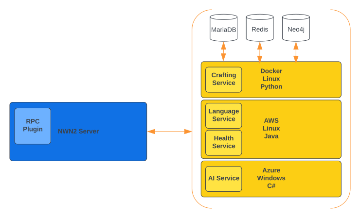

# NWNX4 RPC Plugin

A modern RPC plugin for NWNX4.

## Overview

xp_rpc is a plugin that allows high performance RPC communication between an NWN2 server and any set of microservices. A
microservice can be built in any supported language of both gRPC and Protocol Buffers.

## Purpose



Previously any plugin developed for NWNX4 would be a Windows x86 C++ DLL. This C++ DLL would have a core plugin class:
a child class of the parent class. With the advent of the new ABI interface, plugins expand the capability of supported
plugins to anything that can be developed into a C library, but still targeting the Windows x86 architecture.

Plugins were further designed with a domain-oriented approach (i.e. data, health, system). The xp_rpc plugin
potentially allows a more service-oriented approach. All domains (authentication, data, etc.) can now exist inside a
scalable, distributable, performant microservice running on practically any environment fully (or partially) decoupled
from the server itself.

## gRPC


gRPC with protobufs allow an efficient, fast and secure approach to data contract interfaces. To read more about gRPC
and its capabilities, go [here](https://grpc.io).

## How Does It Work

The plugin uses a handful of protobuf messages and services to build a data contract between itself and the service. A
microservice can then be developed in any supported language with a thorough definition of the service implementation. A
YAML configuration should then be manually set with the list of the service names and their respective paths. With the
NWNX4 application running with the xp_rpc plugin, the application is ready to transmit requests to the microservice.

All that will be left is to send requests through the module using NWScript.

## Use

1. Include the `include/nwnx_rpc.nss` file into your module.
2. All 6 base NWNX* functions are available. The final parameter is optional (nParam2) and defaults to -1.

```
RPCSetInt("clientName", "intName", 255);
RPCSetFloat("clientName", "floatName", 1.335);
RPCSetString("clientName", "stringName", "Hello, world!");

RPCGetInt("clientName", "intName");
RPCGetFloat("clientName", "floatName");
RPCGetString("clientName", "stringName"); 
```

3. Build a microservice to handle the requests.

## Configuration

Clients are connections from the RPC plugin to that of the services. To setup your xp_rpc plugin to bind to the client
on startup, you create a YAML configuration `xp_rpc.yml` at the root of your NWNX4 path. In the previous example, "
clientName" is the unique identifier to the microservice. What follows is a YAML configuration example:

```yaml
server:
  url: localhost:8080
  services:
    logger: true
clients:
  clientName: localhost:3000/clientName
```

| Setting                | Description                                                              |
|------------------------|--------------------------------------------------------------------------|
| server:url             | Set the URL that other services can use to communicate back with xp_rpc. |
| server:services:logger | # Set to true to enable the logger service.                              |
| clients[key]           | Key is the client name; the value is the URL route to the service.       |

## Microservices

Microservices are the real power behind this plugin. They can be developed in any architecture and many languages. 

### Building your Microservice 

Official support for all the gRPC programming languages can be found [here](https://grpc.io/docs/#official-support). 

#### Requirements

Each language requires both the following, so you can compile the protobufs for your application:

* [Protocol Buffers](https://developers.google.com/protocol-buffers/docs/downloads)
* gRPC (per language):
  * [C#](https://grpc.io/docs/languages/csharp/)
  * [C++](https://grpc.io/docs/languages/cpp/)
  * [Dart](https://grpc.io/docs/languages/dart/)
  * [Go](https://grpc.io/docs/languages/go/)
  * [Java](https://grpc.io/docs/languages/java/)
  * [Kotlin](https://grpc.io/docs/languages/kotlin/)
  * [Node](https://grpc.io/docs/languages/node/)
  * [Objective-C](https://grpc.io/docs/languages/objective-c/https://grpc.io/docs/languages/objective-c/)
  * [PHP](https://grpc.io/docs/languages/php/)
  * [Python](https://grpc.io/docs/languages/python/)
  * [Ruby](https://grpc.io/docs/languages/ruby/)

Some other languages are unofficially supported. They are available, but require more setup.

#### Use

Once you have installed your requirements, building your protobufs are easy. For example, if you use Go, the following
bash CLI command will develop your Go files.

```bash
protoc \
  --go_out=../some_go_project/proto \
  --go-grpc_out=./some_go_project/proto \ 
  --go_opt=paths=source_relative \
  --go-grpc_opt=paths=source_relative \
  -Iproto $(find proto -iname "*.proto")
```

Replace go_ with the language you wish to use (java_, cpp_, etc.) and the *_out value with the location you wish to
place your built files. 

From your project folder for your microservice, include your files into your application and create a service using the
documentation mentioned above. For our example, we would build a service like so:

```go
type clientServer struct {
	pbCore.UnimplementedMessageServiceServer
}

func (s *clientServer) NWNXSetInt(ctx context.Context, in *pbNWScript.NWNXSetIntRequest) (*empty.Empty, error) {
	...
}

func (s *clientServer) NWNXSetFloat(ctx context.Context, in *pbNWScript.NWNXSetFloatRequest) (*empty.Empty, error) {
	...
}

func (s *clientServer) NWNXSetString(ctx context.Context, in *pbNWScript.NWNXSetStringRequest) (*empty.Empty, error) {
	...
}

func (s *clientServer) NWNXGetInt(ctx context.Context, in *pbNWScript.NWNXGetIntRequest) (*pbNWScript.Int, error) {
	...
}

func (s *clientServer) NWNXGetFloat(ctx context.Context, in *pbNWScript.NWNXGetFloatRequest) (*pbNWScript.Float, error) {
	...
}

func (s *clientServer) NWNXGetString(ctx context.Context, in *pbNWScript.NWNXGetStringRequest) (*pbNWScript.String, error) {
	...
}
```

Notice that I use pbNWScript, pbCore, and empty aliases. They are the aliases for the NWScript protobufs, the core
Protocol Buffer protobufs, and the Protocol Buffer empty protobuf.

Then fill out the rest of your application by following the tutorials on the gRPC site.

Happy coding!